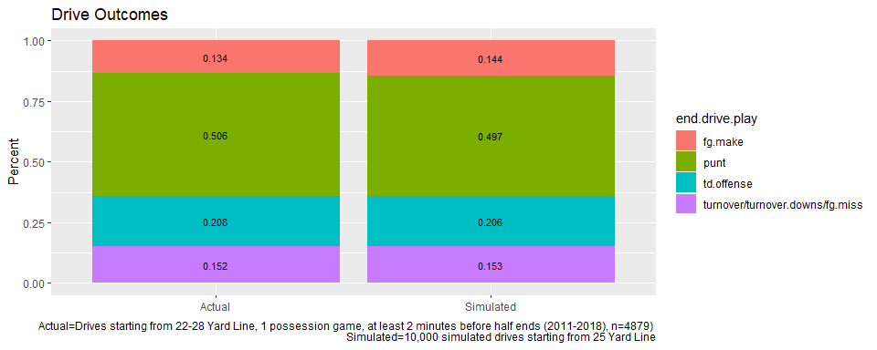
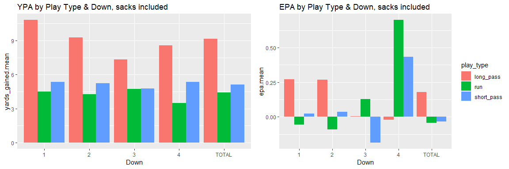
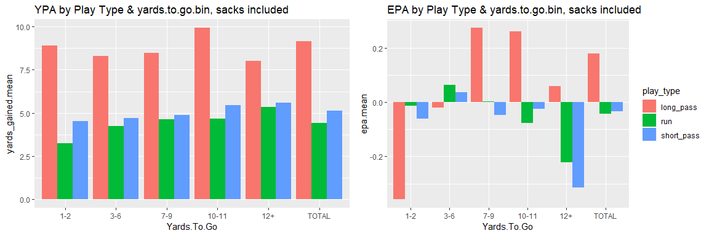

# Simulating NFL Play-Calling Strategies

In this post I’ll use simulation to test out different play-calling
strategies. EPA (expected points added) is very useful in telling you
expected value of a play on average. For example, it will say that
passing on first down gives you +.25 expected points added on average,
whereas running gives you +.1 on average. I’m still trying to understand
though if the variance of a play matters, for example, does it make
sense to take a lower EPA run on first down so you end up with 2nd and 7
rather a higher variance pass that will give you a good chance of second
and long. I ran drive simulations to test out these different
strategies, and then I could see if the high EPA and/or YPA play is the
best choice. I got a lot of this code from [this
post](https://statsbylopez.netlify.com/post/resampling-nfl-drives/)
which was very helpful, and I made changes like creating game states and
some other things.

## Part 1: Methodology: Simulating Drives

The data I am using is PBP data from 2011-2018, filtered to when the
game was within 1-score, \>=2 minutes before halftime and \>=5 minutes
before the end of the game. I define game state below based on down,
yards-to-go, and yards-from-own-goal. Below are some of the
    states:

    ##    State.ID down ydstogo.bin yfog.bin freq percent.pass percent.run percent.punt percent.field_goal
    ## 1         1    1       10-11  (20,25] 5471    0.4697496 0.530250411    0.0000000                  0
    ## 2         2    2       10-11  (20,25] 1090    0.5440367 0.455963303    0.0000000                  0
    ## 3         3    3       10-11  (20,25]  292    0.9349315 0.065068493    0.0000000                  0
    ## 4         4    4       10-11  (20,25]  136    0.0000000 0.007352941    0.9926471                  0
    ## 5         6    2         1-2  (20,25]  145    0.2827586 0.717241379    0.0000000                  0
    ## 6         7    3         1-2  (20,25]  214    0.4439252 0.556074766    0.0000000                  0
    ## 7         8    4         1-2  (20,25]  111    0.0000000 0.027027027    0.9729730                  0
    ## 8         9    1         3-6  (20,25]   39    0.3333333 0.666666667    0.0000000                  0
    ## 9        10    2         3-6  (20,25] 1031    0.4578080 0.542192047    0.0000000                  0
    ## 10       11    3         3-6  (20,25]  726    0.9049587 0.095041322    0.0000000                  0

There are around 300 total states. Next, like in the post I linked
above, I simulate a drive by sampling from the data, sampling the play
result based on the state I am currently in. The drive stops when
there’s a touchdown, turnover,turnover-on-downs, field goal,field goal
miss, or safety. Below is an example of a simulated drive starting from
the
    25:

    ##    down.original yards.to.go yards.from.own.goal State.ID                                                                                                              desc yards_gained new.down new.distance
    ## 1:             1          10                  25        1                                              (5:58) (Shotgun) S.Wilson right end to TB 26 for 4 yards (M.Foster).            4        2            6
    ## 2:             2           6                  29      350                                                    (3:50) D.Brees pass incomplete deep left to B.Cooks (J.Haden).            0        3            6
    ## 3:             3           6                  29      351    (13:48) (No Huddle, Shotgun) P.Manning pass short left to W.Welker pushed ob at DEN 32 for 5 yards (J.Taylor).            5        4            1
    ## 4:             4           1                  34       28 (6:09) R.Allen punts 53 yards to HOU 13, Center-J.Cardona. T.Ervin to HOU 18 for 5 yards (J.Bademosi, J.Cardona).            0        5            1

I repeat this to get 10,000 simulated drives starting from the 25 yard
line. I can now look at how these results line up to drives in the
actual data: <!-- -->

It lines up pretty well, the difference could be due to the fact that
the actual data includes penalties and my simulation doesn’t. Even if
there are differences, I’m mainly focusing on how strategies will
increase from my simulated baseline. Now that I have the baseline, I can
define any custom strategy I want and see how it changes the results.
For example, instead of the default state
    here:

    ##   State.ID down ydstogo.bin yfog.bin freq percent.pass percent.run percent.punt percent.field_goal
    ## 1        1    1       10-11  (20,25] 5471    0.4697496 0.530250411    0.0000000                  0
    ## 2        2    2       10-11  (20,25] 1090    0.5440367 0.455963303    0.0000000                  0
    ## 3        3    3       10-11  (20,25]  292    0.9349315 0.065068493    0.0000000                  0
    ## 4        4    4       10-11  (20,25]  136    0.0000000 0.007352941    0.9926471                  0
    ## 5        6    2         1-2  (20,25]  145    0.2827586 0.717241379    0.0000000                  0

I can increase passes +10% on 1st-3rd
    downs:

    ##   State.ID down ydstogo.bin yfog.bin freq percent.pass percent.run percent.punt percent.field_goal
    ## 1        1    1       10-11  (20,25] 5471    0.5697496 0.430250411    0.0000000                  0
    ## 2        2    2       10-11  (20,25] 1090    0.6440367 0.355963303    0.0000000                  0
    ## 3        3    3       10-11  (20,25]  292    1.0000000 0.000000000    0.0000000                  0
    ## 4        4    4       10-11  (20,25]  136    0.0000000 0.007352941    0.9926471                  0
    ## 5        6    2         1-2  (20,25]  145    0.3827586 0.617241379    0.0000000                  0

For example in state 1, I select a pass 57% of the time instead of 47%
of the time.. pretty simple. In R, I just do a weighted sample now. I
then rerun the 10K simulations for the new strategy.

## Part 2: Methodology: Long and Short Passes

Before I test out different strategies, I wanted to account for one more
thing. I wanted to separate short passes from long passes so that in a
strategy I can specify long or short pass. I define short as \<10
air-yard pass, and long as \>=10 air-yard pass. There’s evidence that
deep passes are where the real value is at, for example
[here](http://archive.advancedfootballanalytics.com/2010/09/deep-vs-short-passes.html)
so I wanted to include this.

The main problem here though which was mentioned in that link is that
sacks happen before a pass is attempted, so you don’t know whether it
should be attributed to short or long. I do have some way to handle this
though. First of all, if a state has 90% long passes and 10% short, then
sacks in that state should probably mostly be attributed as long pass
attempts. In addition, there is probably a different sack-rate for long
and short attempts. To calculate this, I aggregate long-passes,
short-passes, and sacks by state, then estimate how much a change in the
number of long or short passes in a state will increase the sack rate:

    ## 
    ## Call:
    ## lm(formula = percent.sack ~ scale(percent.short.pass) + scale(percent.long.pass) + 
    ##     as.factor(down), data = stateDF)
    ## 
    ## Residuals:
    ##       Min        1Q    Median        3Q       Max 
    ## -0.098658 -0.004505 -0.000258  0.005234  0.093468 
    ## 
    ## Coefficients:
    ##                           Estimate Std. Error t value             Pr(>|t|)    
    ## (Intercept)               0.019237   0.002232   8.619 0.000000000000000249 ***
    ## scale(percent.short.pass) 0.009582   0.001629   5.882 0.000000009603993615 ***
    ## scale(percent.long.pass)  0.014985   0.001374  10.903 < 0.0000000000000002 ***
    ## as.factor(down)2          0.002848   0.002905   0.980                0.328    
    ## as.factor(down)3          0.031731   0.003362   9.439 < 0.0000000000000002 ***
    ## as.factor(down)4          0.009413   0.003852   2.443                0.015 *  
    ## ---
    ## Signif. codes:  0 '***' 0.001 '**' 0.01 '*' 0.05 '.' 0.1 ' ' 1
    ## 
    ## Residual standard error: 0.01791 on 344 degrees of freedom
    ## Multiple R-squared:  0.7384, Adjusted R-squared:  0.7346 
    ## F-statistic: 194.2 on 5 and 344 DF,  p-value: < 0.00000000000000022

Based on this above model, I’m going to assume long passes have a sack
rate of 2x that of short passes. So for example, if a state had 30
short, 30 long and 12 sacks, I say 4 were short, 8 were long attempts.
This is just a way for me to attribute sacks, I think it is somewhat
reasonable. The 2x might be wrong but it is just a parameter that I can
experiment with to see how it affects the results. After attributing the
sacks I end up with
    this:

    ##   State.ID down ydstogo.bin yfog.bin freq percent.short.pass percent.long.pass percent.run percent.punt percent.field_goal
    ## 1        1    1       10-11  (20,25] 5471          0.3065616        0.16318795 0.530250411    0.0000000                  0
    ## 2        2    2       10-11  (20,25] 1090          0.3735254        0.17051132 0.455963303    0.0000000                  0
    ## 3        3    3       10-11  (20,25]  292          0.4217736        0.51315789 0.065068493    0.0000000                  0
    ## 4        4    4       10-11  (20,25]  136          0.0000000        0.00000000 0.007352941    0.9926471                  0
    ## 5        6    2         1-2  (20,25]  145          0.2228907        0.05986794 0.717241379    0.0000000                  0

I’m finally ready to test out several different strategies of increasing
long and/or short passes. Below I show the drive results of different
strategy parameters.

## Part 3: Analyzing the Results

<!-- -->

Above I display the results from different parameters, ex:
x10longpass\_down1-2 means add 10% to long pass percentage on every
1-2nd down state. As you can see from the chart, the parameters that do
the best are long-pass. Adding +10% to first and second down increases
TD-rate and decreases punts. There’s countless strategies to try so I
just showed a few to keep it simple. This isn’t an exact science, and
I’ve noticed that the results vary even with 10K simulations. I’ll
look into different metrics and quantifying the error. The main takeaway
is that long passes definitely sem to increase TD’s and decrease punts
from the baseline “default\_part2”.

The last thing I’d like to look at is how these results are different to
just using EPA and/or YPA. From my simulated data which includes the
estimated sack-rate, I look at EPA and YPA
below:

<!-- --><!-- -->

My results line up well with EPA chart shown on the top right. On 1st
and second down you can see how long passes seem to have high expected
value, which is supported in my simulations. On third down, the effect
isn’t there as much, which I saw in my simulation as there was not
change when I added long passes to 3rd down. While YPA would suggest
long passes is best in all states, looking at EPA seems to provide
better guidance.

## Part 4: Conclusion

In this post I showed my simulation method for testing different play
calling strategies. Long passes, despite their higher variance, seem to
improve the result of drives and lead to both more touchdowns and less
punts. Overall, my results align with “Expected Points Added” values,
which is cool because it confirms that EPA is a good guideline for play
selection, and it also suggests that my system isn’t completely off. I
was hoping to find a totally contrarian result here but it seems for now
that EPA does a good job of improving a drive. There are definitely some
shortcomings, for example, a team might be basing it’s play on what the
defense is giving, and that a deep attempt occurs when things like
coverage and pass protection are in the offense’s favor. It’s possible
that rying to increase deep passing by 10% will result in lower quality
deep pass attempts. I think having data on time to throw and receiver
seperation may be useful in better understanding the EPA difference of
deep and short passes. Finally, another shortcoming is that the binning
I used may be misleading. Changing the binning to short, medium, and
long could definitely make a difference it’s entireley possible that the
really short plays are the ones dragging things down for the short
passes. I’d like to keep testing this system to try out different
strategies or add medium passes. Thanks for reading.

[code](github.com/dlm1223/nfl-simulation)
